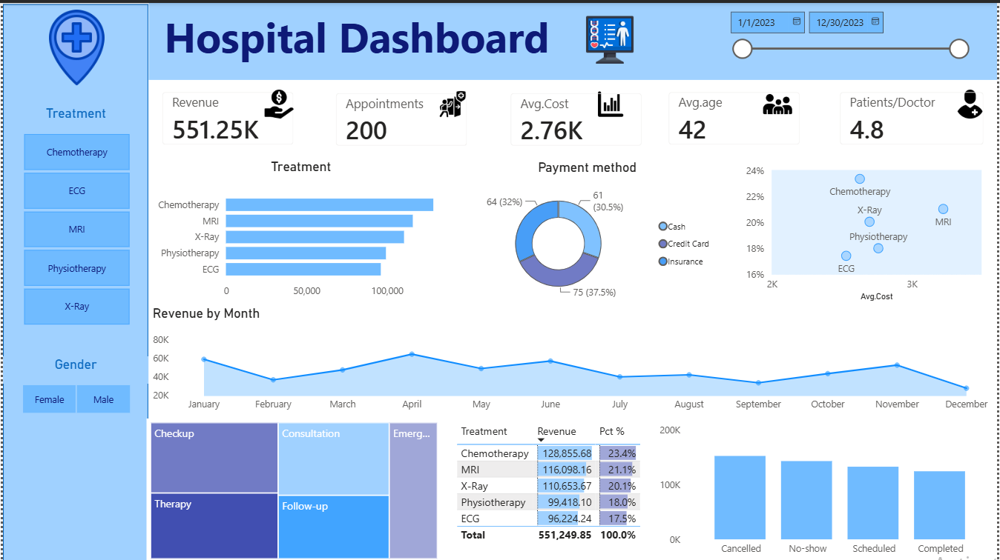

# 🏥 Hospital Management Dashboard — Power BI

## Introduction 

Managing hospital data can feel like a maze, with important information scattered across appointments, treatments, revenue, and patient records. This dashboard is designed to bring these insights together in one clear and interactive interface! Using hospital management data–rich with details on treatments, appointments, patient demographics, revenue, payment methods, and appointment status–this project offers a streamlined way to quickly explore crucial hospital performance trends and operational insights.

## Skills Showcase 

This project put key Power BI features into practice. Here's what I applied:

* **🎨 Dashboard Design:** Crafting a clean, intuitive, and visually appealing hospital analytics dashboard.

* **⚙️ Power Query ETL:** Cleaning, shaping, and preparing hospital data for analysis.

* **🔗 Data Modeling:** Creating an efficient data model to support interactive analysis.

* **🧮 DAX Measures:** Creating custom calculations and measures to derive meaningful hospital performance insights.

* **📊 Visualizations Utilized:**

    * **📈 Column & Bar Charts:** Comparing appointments, treatments, and appointment statuses.

    * **📉 Line Chart:** Analyzing monthly revenue trends.

    * **🍩 Donut Chart:** Visualizing payment method distribution.

    * **🫧 Scatter Chart:** Comparing average treatment cost with average patient age.

    * **🌳 Treemap:** Displaying appointment type distribution.

    * **🔢 KPI Cards:** Highlighting key metrics such as total revenue, total appointments, average treatment cost, average patient age, and patients per doctor.

    * **📋 Tables:** Presenting treatment revenue and percentage contribution in detail.

* **🖱️ Interactive Features:**

    * **🎚️ Slicers:** Enabling dynamic filtering by date, treatment, and gender.

    * **🔄 Cross-Filtering:** Allowing users to interact with visuals and explore different aspects of the data.

    * **🔍 Interactive Analysis:** Enabling users to move from high-level KPIs to detailed treatment and appointment insights.
---

## Dashboard Overview

This dashboard consolidates key hospital metrics into a single, focused page, designed to provide a clear overview of revenue, appointments, treatments, patient demographics, and operational trends at a glance.

This page acts as your concise mission control for hospital performance. It showcases key performance indicators (KPIs) like Total Revenue, Total Appointments, Average Treatment Cost, Average Patient Age, and Patients per Doctor. You can also quickly explore Appointment Trends, Treatment Performance, Payment Methods, and Appointment Status, while comparing Revenue and Revenue Contribution across different Treatments, all designed for an efficient overview of hospital operations and performance.

## Conclusions 

This Hospital Management Dashboard showcases Power BI's ability to transform hospital data into a clear and interactive analytical tool. It enables users to filter and explore essential insights related to revenue, appointments, treatments, patient demographics, and operational performance efficiently on a single page, helping support better data-driven analysis and decision-making.
