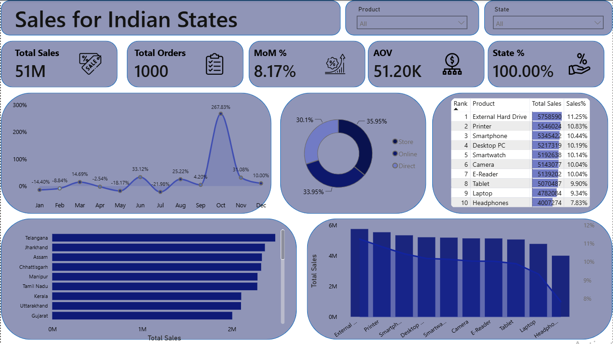

# 📊 Indian Sales Analytics Dashboard — Power BI

## Introduction 

Understanding sales performance across a large and diverse market can be challenging when data is spread across products, states, channels, and time periods. This dashboard brings those dimensions together into an interactive Power BI report, making it easier to evaluate sales performance, identify regional and product-level patterns, and uncover meaningful trends through dynamic analysis.

## Skills Showcase 

This project put key Power BI features into practice. Here's what I applied:

* **🎨 Dashboard Design:** Crafting a clean, intuitive, and visually appealing sales analytics dashboard.

* **⚙️ Power Query ETL:** Cleaning, transforming, and preparing sales data for analysis.

* **🔗 Data Modeling:** Creating an efficient data model to support interactive sales analysis.

* **🧮 DAX Measures:** Creating custom calculations and measures to analyze sales performance and derive meaningful insights.

* **📊 Visualizations Utilized:**
    * **📈 Column & Bar Charts:** Comparing sales performance across products, states, and channels.
    * **📉 Line Chart:** Analyzing sales trends over time.
    * **🔢 KPI Cards:** Highlighting key sales performance metrics.
    * **📋 Tables:** Presenting detailed product and sales performance information.
    * **🏆 Ranking Visuals:** Comparing products based on their sales performance.

* **🖱️ Interactive Features:**
    * **🎚️ Slicers:** Enabling dynamic filtering by product, state, and other relevant dimensions.
    * **🔄 Cross-Filtering:** Allowing users to interact with visuals and explore different aspects of sales data.
    * **🔄 Dynamic Titles:** Using `SELECTEDVALUE()` to make visual titles respond to user selections.
    * **🏆 Dynamic Ranking:** Using `RANKX()` to dynamically rank products based on sales performance.
    * **🔍 Interactive Analysis:** Enabling users to move from high-level sales KPIs to detailed product, state, and channel insights.
---

## Dashboard Overview

This dashboard brings key sales metrics together into a single, focused page, providing a clear overview of sales performance across products, states, channels, and time periods at a glance.

This page acts as your concise mission control for sales performance. It showcases key performance indicators (KPIs) for overall sales performance while allowing you to explore sales trends, product performance, state-wise analysis, and sales channels. You can also compare product performance, analyze sales contribution, and dynamically rank products, all designed to provide an efficient overview of sales performance and business insights

## Conclusions 

This Indian Sales Analytics Dashboard showcases Power BI’s ability to transform sales data into a clear and interactive analytical tool. It enables users to filter and explore essential insights related to sales performance, products, states, channels, and trends, while leveraging advanced DAX techniques for dynamic analysis and ranking. The project demonstrates how interactive dashboards can support efficient data-driven analysis and business decision-making.
